# Guía: Cómo Agregar un Plugin a Backstage

## 📋 Índice
1. [Tipos de Plugins](#tipos-de-plugins)
2. [Proceso General](#proceso-general)
3. [Plugin de Frontend](#plugin-de-frontend)
4. [Plugin de Backend](#plugin-de-backend)
5. [Ejemplos Prácticos](#ejemplos-prácticos)
6. [Troubleshooting](#troubleshooting)

---

## Tipos de Plugins

### 1. Plugin de Frontend
- Se ejecuta en el navegador
- Agrega UI/componentes visuales
- Ejemplo: ArgoCD card, Kubernetes dashboard

### 2. Plugin de Backend
- Se ejecuta en el servidor
- Proporciona APIs y servicios
- Ejemplo: Catalog backend, Scaffolder backend

### 3. Plugin Full-Stack
- Combina frontend y backend
- Ejemplo: TechDocs, Search

---

## Proceso General

```mermaid
graph TB
    START[Identificar Plugin]
    SEARCH[Buscar en npm/GitHub]
    INSTALL[Instalar Dependencia]
    CONFIG[Configurar Plugin]
    INTEGRATE[Integrar en Código]
    TEST[Probar]
    DONE[✅ Completado]
    
    START --> SEARCH
    SEARCH --> INSTALL
    INSTALL --> CONFIG
    CONFIG --> INTEGRATE
    INTEGRATE --> TEST
    TEST --> DONE
    
    style START fill:#4A90E2
    style DONE fill:#28A745
```



---

## Plugin de Frontend

### Paso 1: Buscar el Plugin

```bash
# Buscar en npm
npm search backstage-plugin-<nombre>

# O en el catálogo oficial
# https://backstage.io/plugins
```

### Paso 2: Instalar

```bash
# Navegar al directorio de la app
cd packages/app

# Instalar el plugin
yarn add @backstage/plugin-<nombre>
# O para plugins de terceros
yarn add @roadiehq/backstage-plugin-<nombre>
```

### Paso 3: Importar en App.tsx

```typescript
// packages/app/src/App.tsx
import { PluginPage } from '@backstage/plugin-<nombre>';

// Agregar ruta
<Route path="/plugin-path" element={<PluginPage />} />
```

### Paso 4: Agregar al Menú (Opcional)

```typescript
// packages/app/src/components/Root/Root.tsx
import PluginIcon from '@material-ui/icons/Plugin';

<SidebarItem icon={PluginIcon} to="plugin-path" text="Plugin Name" />
```

### Ejemplo Completo: Plugin de GitHub Actions

```bash
# 1. Instalar
cd packages/app
yarn add @backstage/plugin-github-actions

# 2. Importar en EntityPage.tsx
```

```typescript
// packages/app/src/components/catalog/EntityPage.tsx
import {
  EntityGithubActionsContent,
  isGithubActionsAvailable,
} from '@backstage/plugin-github-actions';

// 3. Agregar al serviceEntityPage
const serviceEntityPage = (
  <EntityLayout>
    {/* ... otras rutas ... */}
    
    <EntityLayout.Route 
      path="/github-actions" 
      title="GitHub Actions"
      if={isGithubActionsAvailable}
    >
      <EntityGithubActionsContent />
    </EntityLayout.Route>
  </EntityLayout>
);
```

```yaml
# 4. Agregar anotación en catalog-info.yaml
metadata:
  annotations:
    github.com/project-slug: owner/repo
```

---

## Plugin de Backend

### Paso 1: Instalar

```bash
# Navegar al directorio del backend
cd packages/backend

# Instalar el plugin
yarn add @backstage/plugin-<nombre>-backend
```

### Paso 2: Agregar al Backend (Nuevo Sistema)

```typescript
// packages/backend/src/index.ts
import { createBackend } from '@backstage/backend-defaults';

const backend = createBackend();

// Agregar plugin
backend.add(import('@backstage/plugin-<nombre>-backend'));

backend.start();
```

### Paso 3: Configurar en app-config.yaml

```yaml
# app-config.yaml
pluginName:
  # Configuración específica del plugin
  option1: value1
  option2: value2
```

### Ejemplo Completo: Plugin de Kubernetes

```bash
# 1. Instalar (ya está instalado en este proyecto)
cd packages/backend
yarn add @backstage/plugin-kubernetes-backend
```

```typescript
// 2. Agregar al backend (ya está agregado)
// packages/backend/src/index.ts
backend.add(import('@backstage/plugin-kubernetes-backend'));
```

```yaml
# 3. Configurar
# app-config.yaml
kubernetes:
  serviceLocatorMethod:
    type: 'multiTenant'
  clusterLocatorMethods:
    - type: 'config'
      clusters:
        - url: https://kubernetes.default.svc
          name: local-cluster
          authProvider: 'serviceAccount'
```

---

## Ejemplos Prácticos

### Ejemplo 1: Agregar Plugin de SonarQube

#### Frontend

```bash
# 1. Instalar
cd packages/app
yarn add @backstage/plugin-sonarqube

# 2. Agregar a EntityPage
```

```typescript
// packages/app/src/components/catalog/EntityPage.tsx
import {
  EntitySonarQubeCard,
  isSonarQubeAvailable,
} from '@backstage/plugin-sonarqube';

// En serviceEntityPage, agregar:
<EntityLayout.Route path="/code-quality" title="Code Quality">
  <Grid container spacing={3}>
    <Grid item xs={12}>
      <EntitySwitch>
        <EntitySwitch.Case if={isSonarQubeAvailable}>
          <EntitySonarQubeCard />
        </EntitySwitch.Case>
      </EntitySwitch>
    </Grid>
  </Grid>
</EntityLayout.Route>
```

#### Backend

```bash
# 1. Instalar
cd packages/backend
yarn add @backstage/plugin-sonarqube-backend
```

```typescript
// 2. Agregar al backend
backend.add(import('@backstage/plugin-sonarqube-backend'));
```

```yaml
# 3. Configurar
sonarqube:
  baseUrl: https://sonarqube.example.com
  apiKey: ${SONARQUBE_TOKEN}
```

```yaml
# 4. Agregar anotación en catalog-info.yaml
metadata:
  annotations:
    sonarqube.org/project-key: my-project
```

### Ejemplo 2: Agregar Plugin de Datadog

```bash
# 1. Instalar
cd packages/app
yarn add @roadiehq/backstage-plugin-datadog

# 2. Importar y usar
```

```typescript
// packages/app/src/components/catalog/EntityPage.tsx
import {
  EntityDatadogContent,
  isDatadogAvailable,
} from '@roadiehq/backstage-plugin-datadog';

<EntityLayout.Route 
  path="/datadog" 
  title="Datadog"
  if={isDatadogAvailable}
>
  <EntityDatadogContent />
</EntityLayout.Route>
```

```yaml
# 3. Configurar
proxy:
  '/datadog/api':
    target: https://api.datadoghq.com
    headers:
      DD-API-KEY: ${DATADOG_API_KEY}
      DD-APPLICATION-KEY: ${DATADOG_APP_KEY}
```

### Ejemplo 3: Agregar Plugin de PagerDuty

```bash
# Frontend
cd packages/app
yarn add @pagerduty/backstage-plugin

# Backend
cd packages/backend
yarn add @pagerduty/backstage-plugin-backend
```

```typescript
// Frontend - EntityPage.tsx
import { EntityPagerDutyCard } from '@pagerduty/backstage-plugin';

<Grid item md={6}>
  <EntityPagerDutyCard />
</Grid>
```

```typescript
// Backend - index.ts
backend.add(import('@pagerduty/backstage-plugin-backend'));
```

```yaml
# Configuración
pagerduty:
  apiToken: ${PAGERDUTY_TOKEN}
```

---

## Configuración Avanzada

### Plugin con Proxy

Algunos plugins requieren proxy para evitar CORS:

```yaml
# app-config.yaml
proxy:
  '/plugin-api':
    target: https://api.example.com
    changeOrigin: true
    headers:
      Authorization: Bearer ${API_TOKEN}
```

### Plugin con Permisos

```typescript
// packages/backend/src/index.ts
import { createBackendModule } from '@backstage/backend-plugin-api';

const pluginPermissions = createBackendModule({
  pluginId: 'plugin-name',
  moduleId: 'permissions',
  register(env) {
    env.registerInit({
      deps: {
        permissions: coreServices.permissions,
      },
      async init({ permissions }) {
        // Configurar permisos
      },
    });
  },
});

backend.add(pluginPermissions);
```

---

## Troubleshooting

### Error: "Module not found"

```bash
# Verificar instalación
yarn list @backstage/plugin-<nombre>

# Reinstalar
yarn install

# Limpiar caché
yarn cache clean
rm -rf node_modules
yarn install
```

### Error: "Plugin not loading"

```typescript
// Verificar importación
import { Plugin } from '@backstage/plugin-<nombre>';

// Verificar que está en el código
console.log('Plugin imported:', Plugin);
```

### Error: "Configuration missing"

```yaml
# Verificar app-config.yaml
pluginName:
  required-option: value

# Verificar variables de entorno
echo $PLUGIN_TOKEN
```

### Error: "Backend plugin not working"

```bash
# Verificar logs del backend
# En la terminal donde corre Backstage

# Buscar errores relacionados con el plugin
grep -i "plugin-name" logs.txt
```

### Plugin no aparece en UI

1. **Verificar ruta**: ¿Está agregada en App.tsx?
2. **Verificar condición**: ¿Tiene un `if` que no se cumple?
3. **Verificar anotaciones**: ¿El entity tiene las anotaciones necesarias?
4. **Verificar permisos**: ¿El usuario tiene permisos?

---

## Checklist de Instalación

### Frontend Plugin

- [ ] Instalar dependencia en `packages/app`
- [ ] Importar componentes en archivo apropiado
- [ ] Agregar ruta o componente en UI
- [ ] Agregar al menú (si aplica)
- [ ] Configurar en `app-config.yaml`
- [ ] Agregar anotaciones en `catalog-info.yaml`
- [ ] Probar en navegador
- [ ] Verificar que no hay errores en consola

### Backend Plugin

- [ ] Instalar dependencia en `packages/backend`
- [ ] Agregar al `index.ts`
- [ ] Configurar en `app-config.yaml`
- [ ] Configurar variables de entorno
- [ ] Reiniciar backend
- [ ] Verificar logs del backend
- [ ] Probar funcionalidad
- [ ] Verificar que API responde

---

## Recursos

### Catálogos de Plugins

- [Backstage Plugin Marketplace](https://backstage.io/plugins)
- [Roadie Plugins](https://roadie.io/backstage/plugins/)
- [Spotify Plugins](https://github.com/backstage/backstage/tree/master/plugins)

### Documentación

- [Backstage Plugin Development](https://backstage.io/docs/plugins/)
- [Plugin Architecture](https://backstage.io/docs/plugins/plugin-development)
- [Backend System](https://backstage.io/docs/backend-system/)

### Ejemplos

- [Backstage Demo](https://demo.backstage.io/)
- [Plugin Examples](https://github.com/backstage/backstage/tree/master/plugins)

---

## Mejores Prácticas

1. **Leer la documentación** del plugin antes de instalar
2. **Verificar compatibilidad** con tu versión de Backstage
3. **Probar en dev** antes de producción
4. **Configurar permisos** apropiadamente
5. **Monitorear logs** después de instalar
6. **Documentar** la configuración para el equipo
7. **Mantener actualizado** el plugin

---

**Nota**: Este proyecto ya tiene varios plugins instalados. Revisa `packages/app/package.json` y `packages/backend/package.json` para ver cuáles están disponibles.
