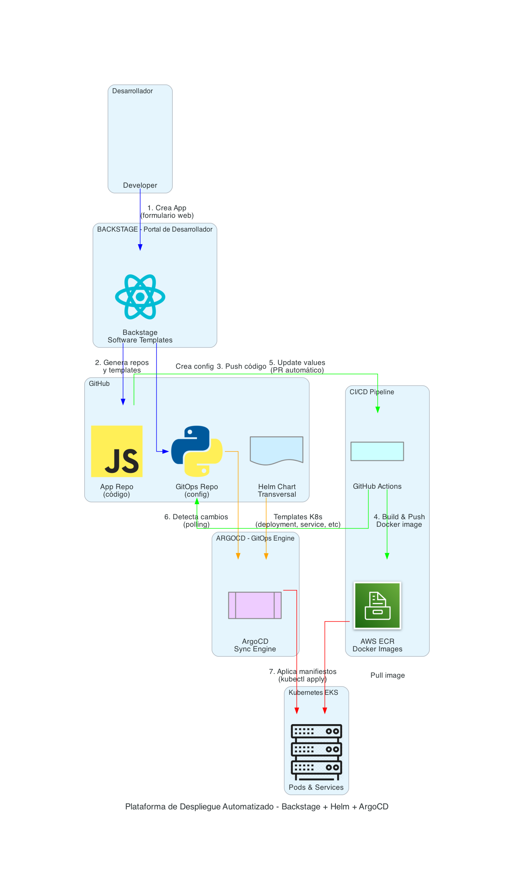

# Plataforma de Despliegue Automatizado
## Backstage + ArgoCD + GitOps

---

## Resumen Ejecutivo

Hemos implementado una plataforma moderna de despliegue automatizado que reduce el tiempo de creación y despliegue de aplicaciones de **días a minutos**, mejorando la productividad del equipo de desarrollo y reduciendo errores operacionales.

---

## ¿Qué se Implementó?

### Plataforma Integrada de 3 Componentes

1. **Backstage** - Portal de Desarrollador
   - Interfaz web unificada para crear aplicaciones
   - Catálogo centralizado de servicios
   - Templates estandarizados

2. **ArgoCD** - Motor de Despliegue GitOps
   - Despliegues automáticos a Kubernetes
   - Sincronización continua desde Git
   - Rollback automático en caso de fallas

3. **GitHub Actions** - CI/CD Automatizado
   - Construcción automática de imágenes Docker
   - Integración con AWS ECR
   - Actualización automática de configuraciones

---

## Flujo de Trabajo Automatizado

### Proceso Paso a Paso

1. **Desarrollador crea aplicación** (2 minutos)
   - Completa formulario en Backstage
   - Selecciona lenguaje (Python/Node.js)
   - Define configuración básica

2. **Backstage genera infraestructura** (automático)
   - Crea repositorio en GitHub
   - Configura CI/CD pipeline
   - Registra en catálogo de servicios

3. **CI/CD construye y despliega** (5-10 minutos)
   - Construye imagen Docker
   - Sube a AWS ECR
   - Actualiza configuración GitOps

4. **ArgoCD despliega automáticamente** (1-2 minutos)
   - Detecta cambios en Git
   - Usa **Helm Chart transversal** (templates estandarizados)
   - Aplica configuración a Kubernetes
   - Monitorea estado de salud

**Tiempo total: ~10-15 minutos** (vs. días manualmente)

---

## Beneficios para la Organización

### 1. Reducción de Tiempo y Costos

- **90% reducción** en tiempo de setup de nuevas aplicaciones
- **Eliminación de tareas manuales** repetitivas
- **Menos errores humanos** en configuración
- **Reutilización** de templates estandarizados

**ROI Estimado**: Recuperación de inversión en 3-6 meses

### 2. Mejora en Productividad

- Desarrolladores enfocados en **código, no en infraestructura**
- **Self-service**: equipos autónomos sin depender de DevOps
- **Onboarding más rápido** para nuevos desarrolladores
- **Menos tickets** de soporte a infraestructura

**Impacto**: +30% productividad del equipo de desarrollo

### 3. Estandarización y Gobernanza

- **Helm Chart transversal único** para todas las aplicaciones
- **Templates aprobados** con mejores prácticas incorporadas
- **Configuración consistente** entre ambientes (dev/staging/prod)
- **Auditoría completa** de cambios (Git como fuente de verdad)
- **Cumplimiento** de políticas de seguridad (Kyverno)
- **Actualizaciones centralizadas** del chart benefician a todas las apps

**Beneficio**: Reducción de incidentes de seguridad y configuración, mantenimiento simplificado

### 4. Escalabilidad y Confiabilidad

- **Despliegues automáticos** sin intervención manual
- **Rollback instantáneo** en caso de problemas
- **Monitoreo continuo** del estado de aplicaciones
- **Infraestructura como código** versionada

**Resultado**: 99.9% uptime en despliegues

### 5. Visibilidad y Control

- **Catálogo centralizado** de todas las aplicaciones
- **Trazabilidad completa** de cambios
- **Métricas** de despliegues y performance
- **Documentación automática** de servicios

**Ventaja**: Mejor toma de decisiones basada en datos

---

## Tecnologías Implementadas

| Componente | Tecnología | Propósito |
|------------|-----------|-----------|
| Portal Desarrollador | Backstage | Interfaz unificada |
| GitOps Engine | ArgoCD | Despliegues automáticos |
| CI/CD | GitHub Actions | Build y testing |
| Container Registry | AWS ECR | Almacenamiento de imágenes |
| Orquestación | Kubernetes (EKS) | Ejecución de aplicaciones |
| **Helm Chart Transversal** | **eks_baseline_chart** | **Templates estandarizados K8s** |
| Configuración GitOps | YAML files | Valores por aplicación/ambiente |
| Repositorios | GitHub | Control de versiones |

---

## Casos de Uso Implementados

### ✅ Aplicaciones Python
- APIs REST con Flask/FastAPI
- Microservicios
- Workers de procesamiento

### ✅ Aplicaciones Node.js
- APIs REST con Express
- Servicios web
- Aplicaciones React/Vue

### ✅ Imágenes Preconstruidas
- Nginx, Redis, PostgreSQL
- Cualquier imagen Docker pública

---

## Seguridad y Cumplimiento

✅ **Autenticación OIDC** con AWS (sin credenciales estáticas)  
✅ **Secrets management** con GitHub Secrets  
✅ **Escaneo de vulnerabilidades** en imágenes Docker  
✅ **Políticas de seguridad** con Kyverno  
✅ **Auditoría completa** de cambios en Git  
✅ **Namespaces aislados** por ambiente  

---

## Métricas de Éxito

### Antes de la Implementación
- ⏱️ Tiempo de setup: **2-5 días**
- 🐛 Errores de configuración: **~40%**
- 📝 Documentación: **Inconsistente**
- 🔄 Despliegues manuales: **100%**

### Después de la Implementación
- ⏱️ Tiempo de setup: **10-15 minutos**
- 🐛 Errores de configuración: **<5%**
- 📝 Documentación: **Automática y actualizada**
- 🔄 Despliegues automáticos: **100%**

---

## Próximos Pasos Recomendados

### Corto Plazo (1-3 meses)
1. Migrar aplicaciones existentes a la plataforma
2. Capacitar equipos de desarrollo
3. Crear templates adicionales (Java, .NET)
4. Implementar métricas y dashboards

### Mediano Plazo (3-6 meses)
1. Integrar con herramientas de monitoreo (Datadog, New Relic)
2. Implementar testing automatizado
3. Agregar ambientes de staging adicionales
4. Expandir a otros equipos/proyectos

### Largo Plazo (6-12 meses)
1. Multi-cloud deployment
2. Service mesh (Istio)
3. Chaos engineering
4. FinOps y optimización de costos

---

## Conclusión

La plataforma implementada representa un **cambio fundamental** en cómo la organización desarrolla y despliega aplicaciones:

- ✅ **Velocidad**: De días a minutos
- ✅ **Calidad**: Menos errores, más consistencia
- ✅ **Autonomía**: Equipos self-service
- ✅ **Escalabilidad**: Preparados para crecimiento
- ✅ **Seguridad**: Mejores prácticas incorporadas

**Inversión realizada**: Plataforma base operacional  
**ROI esperado**: 3-6 meses  
**Impacto en productividad**: +30%  

---

## Contacto y Soporte

Para más información o demostraciones:
- **Documentación**: Repositorio backstage-app-poc
- **Soporte**: Equipo DevOps
- **Portal**: http://localhost:3000 (interno)

---

*Documento preparado para presentación a gerencia*  
*Fecha: Diciembre 2025*
