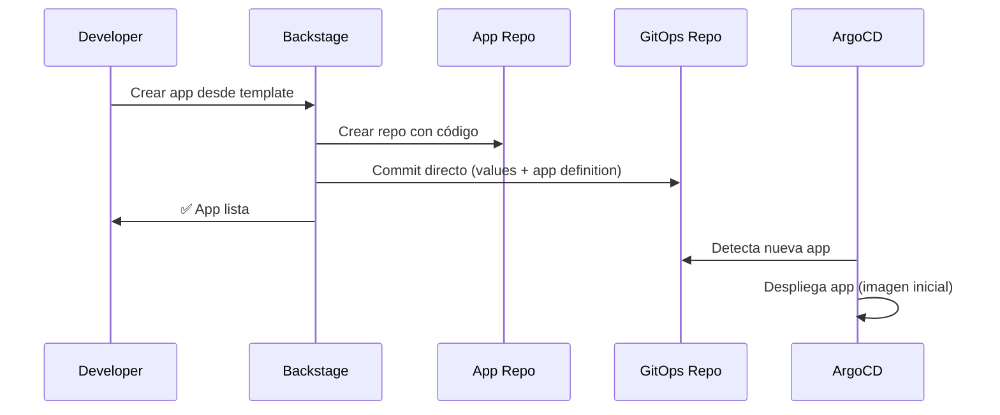
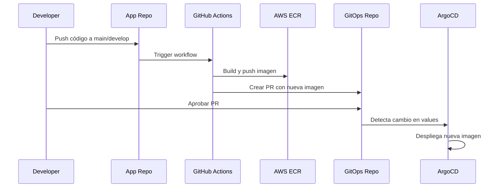

# Flujo de Trabajo Optimizado - Backstage + ArgoCD + GitOps

## Resumen de Mejoras Implementadas

Este documento describe las optimizaciones realizadas al flujo de trabajo para eliminar pasos manuales y evitar builds innecesarios.

## Problema Original

1. **Setup inicial requería aprobación manual**: Al crear una app, se generaba un PR en GitOps que debía aprobarse manualmente antes de que el primer build funcionara
2. **Builds innecesarios**: El workflow se ejecutaba cuando se hacían cambios en GitOps, causando builds circulares
3. **Dependencia manual**: El usuario debía aprobar el PR de GitOps antes de poder hacer el primer build

## Solución Implementada

### 1. Commit Directo en Setup Inicial

**Cambio**: En el template de Backstage, el paso `publish-gitops` ahora usa `publish:github` en lugar de `publish:github:pull-request`.

**Resultado**: 
- El setup inicial hace commit directo a `main` en el repo GitOps
- No requiere aprobación manual
- La aplicación queda lista inmediatamente para el primer build

**Código**:
```yaml
- id: publish-gitops
  name: Publicar en Repositorio GitOps
  action: publish:github
  input:
    repoUrl: github.com?repo=gitops-apps&owner=bcocbo
    description: 'Setup inicial de ${{ parameters.name }} en ${{ parameters.environment }}'
    sourcePath: .
    targetPath: .
    gitCommitMessage: |
      feat: Add ${{ parameters.name }} to ${{ parameters.environment }}
      
      Creado automáticamente por Backstage
```

### 2. Triggers Optimizados en CI/CD

**Cambio**: El workflow de CI/CD solo se ejecuta en cambios relevantes del código de la aplicación.

**Configuración**:
```yaml
on:
  push:
    branches:
      - main
      - develop
    paths-ignore:
      - 'README.md'
      - 'docs/**'
      - '.gitignore'
```

**Resultado**:
- ✅ Build se ejecuta cuando hay cambios en el código de la app
- ❌ Build NO se ejecuta cuando se actualiza el values.yaml en GitOps
- ❌ Build NO se ejecuta en cambios de documentación

### 3. PRs Solo para Actualizaciones de Imagen

**Comportamiento**: El workflow de CI/CD sigue creando PRs en GitOps para actualizaciones de imagen.

**Razón**: Permite revisión de cambios de imagen antes de despliegue automático por ArgoCD.

**Flujo**:
1. Developer hace push a `main` o `develop` en repo de app
2. CI/CD construye imagen y la sube a ECR
3. CI/CD crea PR en GitOps con nueva imagen
4. Al aprobar PR, ArgoCD despliega automáticamente

## Flujo Completo Optimizado

### Creación de Nueva Aplicación



### Actualización de Aplicación



## Ventajas del Nuevo Flujo

1. **Setup Automático**: No requiere aprobación manual para empezar
2. **Sin Builds Circulares**: Los cambios en GitOps no disparan builds
3. **Revisión Controlada**: Las actualizaciones de imagen siguen requiriendo aprobación
4. **Eficiencia**: Solo se construyen imágenes cuando hay cambios reales en el código

## Archivos Modificados

1. `examples/argocd-template/template.yaml`
   - Cambio de `publish:github:pull-request` a `publish:github`
   - Actualización de mensajes de output

2. `examples/argocd-template/content/.github/workflows/ci.yaml`
   - Eliminado trigger `pull_request`
   - Agregado `paths-ignore` para evitar builds innecesarios
   - Mantenido creación de PR para actualizaciones de imagen

## Próximos Pasos

Para aplicar estos cambios:

1. **Reiniciar Backstage** para cargar el template actualizado:
   ```bash
   ./restart-backstage.sh
   ```

2. **Probar creando una nueva app**:
   - Ir a Backstage UI
   - Crear nueva app desde template
   - Verificar que no se crea PR inicial en GitOps
   - Verificar que ArgoCD detecta la app automáticamente

3. **Probar el flujo de actualización**:
   - Hacer cambio en código de la app
   - Push a main/develop
   - Verificar que se crea PR en GitOps con nueva imagen
   - Aprobar PR
   - Verificar despliegue en ArgoCD

## Notas Importantes

- El primer build de una app custom se ejecutará cuando hagas el primer push a `main` o `develop`
- Para apps con imagen preconstruida (nginx, redis, etc.), no hay workflow de CI/CD
- Los cambios en documentación (README, docs/) no disparan builds
- ArgoCD está configurado con `automated: true` para despliegue automático tras merge

## Troubleshooting

### Si el setup inicial no funciona

Verificar que el token de GitHub tiene permisos para:
- Crear repositorios
- Hacer commits directos a `main` en gitops-apps

### Si los builds se siguen ejecutando en cambios de GitOps

Verificar que el workflow en el repo de la app tiene:
```yaml
on:
  push:
    branches:
      - main
      - develop
    paths-ignore:
      - 'README.md'
      - 'docs/**'
      - '.gitignore'
```

Y que NO tiene trigger `pull_request`.
